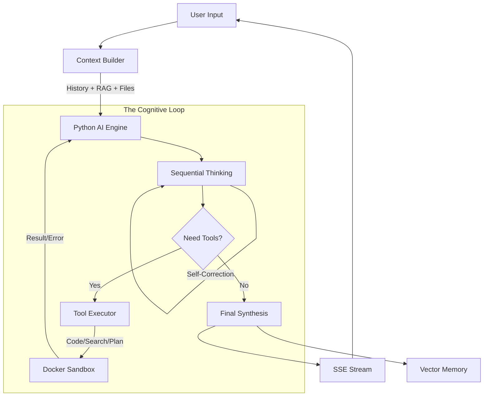

<div align="center">
  
  <br />
  
  # E G O
  
  **The Autonomous AI Agent Operating System**

  
  <p align="center">
    <b>Think. Plan. Execute. Remember.</b><br>
    EGO is a self-hosted, sandboxed AI platform that turns LLMs into stateful, autonomous agents capable of complex reasoning, coding, and long-term memory recall.
  </p>
</div>

---

## ⚡ What is EGO?

EGO is not just a chatbot. It is a **cognitive architecture** designed to overcome the limitations of stateless LLMs. It separates **System Orchestration** (Go) from **Cognitive Reasoning** (Python), creating a robust environment where AI can:

1.  **Reason sequentially** before answering (Chain-of-Thought).
2.  **Execute code** in a secure, isolated Docker sandbox.
3.  **Retain context** across infinite sessions using Hybrid Search (Vector + Keyword).
4.  **Plan autonomously**, breaking complex tasks into trackable steps.

> *"Transparent, Powerful, Open, Deep, Flexible."*

---

## 🧠 The Agent Loop (How it Works)

At the heart of EGO lies a sophisticated **Reasoning Loop**. Unlike standard RAG apps, EGO doesn't just retrieve and answer. It runs a recursive cognitive process:



### The 4-Step Process
1.  **Gather Context**: The system pulls relevant memories, file contents, and chat history.
2.  **Take Action**: The agent decides if it needs to search the web, write Python code, or query its knowledge base.
3.  **Verify Results**: Tool outputs are analyzed. If code fails, it debugs itself. If search is vague, it refines queries.
4.  **Reflect & Refine**: The agent critiques its own reasoning before presenting the final answer.

---

## 🚀 Key Features

### 🛡️ Secure Sandbox (EgoCodeExec)
Code execution happens in an ephemeral **Docker Container**.
*   **Isolation**: No access to the host filesystem.
*   **Networking**: Restricted access (allowlist only).
*   **Libraries**: Pre-installed data science stack (`numpy`, `pandas`, `sympy`).

### 💾 Holographic Memory (RAG++)
EGO remembers *everything* using a **Hybrid Search** mechanism powered by **PostgreSQL (pgvector)**:
*   **Semantic Search**: Finds concepts related by meaning.
*   **Full-Text Search**: Finds specific keywords.
*   **Temporal Ranking**: Prioritizes recent and relevant memories.
*   **File Vectorization**: Uploaded PDFs and texts are chunked and embedded instantly.

### 🛠️ Integrated Tools
*   **EgoSearch**: Real-time global web access (Google).
*   **EgoTube**: Semantic analysis of YouTube video transcripts.
*   **EgoWiki**: Encyclopedic verification.
*   **EgoCalc**: Symbolic mathematics.

### 🎭 Adaptive Modes (Personas)
EGO switches its cognitive architecture based on the task:
*   **⚡ Adaptive**: Low latency, balanced for general conversation.
*   **🔬 Deeper**: Forces extended "Chain-of-Thought" reasoning for complex logic.
*   **🌍 Research**: Optimized for deep web searching and report generation.
*   **🤖 Agent**: Unlocks full sandbox access for autonomous coding tasks.

---

## 🛠️ Technical Architecture

| Component | Technology | Responsibility |
| :--- | :--- | :--- |
| **Orchestrator** | **Go (Golang) 1.25** | High-performance WebSocket/SSE gateway, Auth, DB management, File processing. The "Spine". |
| **AI Engine** | **Python 3.12 + FastAPI** | LLM Inference (Gemini/OpenAI), Tool routing, Sandbox management, Thinking loop. The "Brain". |
| **Frontend** | **SvelteKit 5** | Reactive UI, Real-time streaming, Markdown rendering, State management (Runes). |
| **Database** | **PostgreSQL 16** | Relational data (Users, Sessions) + **pgvector** (Embeddings). |
| **Storage** | **MinIO** | Object storage for file attachments. |
| **Infra** | **Docker Compose** | Orchestrates the entire stack including the Sandbox network. |

---

## ⚡ Getting Started

### Prerequisites
*   Docker & Docker Compose
*   Git

### 1. Clone & Config
```bash
git clone https://github.com/qzbxwv/EGO.git
cd EGO

# Create environment config
cp .env.example .env
```

### 2. Configure Keys (`.env`)
Open `.env` and add your API keys. EGO supports multiple providers, but **Google Gemini** is the default optimization.
```ini
OPENAI_API_KEY=sk-...
ANTHROPIC_API_KEY=sk-ant-...
# Database & S3 defaults usually work out-of-the-box for local dev
```

### 3. Launch
```bash
# Start all services (Backend, Frontend, DB, MinIO, Sandbox)
docker-compose up -d --build
```

### 4. Access
*   **Frontend**: [http://localhost:8080](http://localhost:8080)
*   **MinIO Console**: [http://localhost:9001](http://localhost:9001)

---

## 📸 Interface

The EGO UI is built for productivity:
*   **Markdown & LaTeX**: Beautiful rendering of code and math.
*   **Thinking Block**: Collapsible "Thought Process" to see how the AI arrived at an answer.
*   **Sidebar**: Quick access to history, settings, and memory management.
*   **Stats**: Real-time token usage and cost estimation.

---

---

<p align="center">
  Built by the EGO Team.
</p>